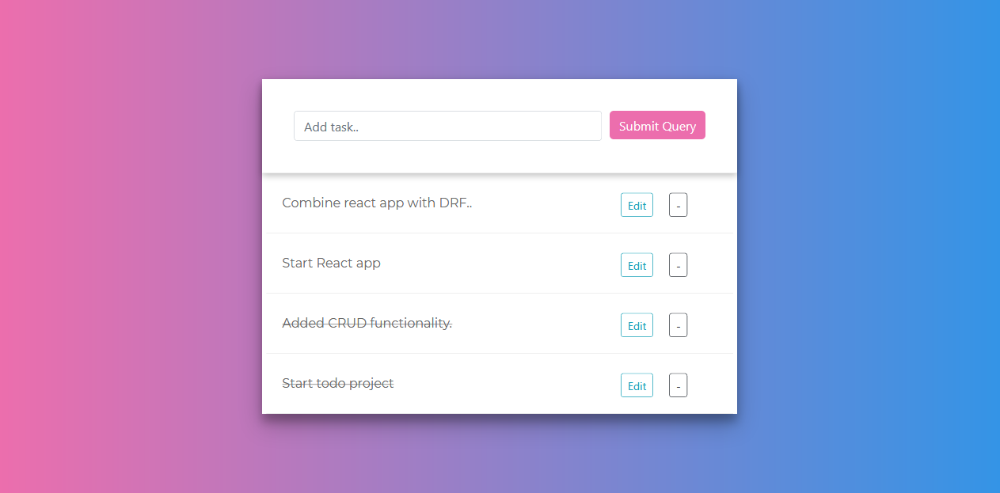

# Todo-DRF-React

Its a TODO App with backend designed using Django REST framework and React as the frontend.

### Installation

1 - Install requirements

```bash
pip install -r requirements.txt
```

2 - Create superuser

```bash
py manage.py createsuperuser
```

3 - Install node_modules and run build

```bash
cd frontend
npm install
npm run build
```

4 - Runserver on port 8000

```bash
cd ../
python manage.py runserver
    
http://127.0.0.1:8000/
```


